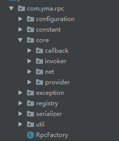

# yma-rpc
一个简单的RPC实现
## 工程结构


#### core包
包含调用层、网络层
#### registry包
包含注册中心（未完成）
#### serializer包
包含序列化

### 示例（普通java程序）
###### api接口

````
    @RpcApi(serviceName = "helloProvider",address = "192.168.10.148:9090")
    public interface HelloService {
        String hello(String s);
    }
````
###### api实现
````
@Rpc
public class HelloServiceImpl implements HelloService{
    @Override
    public String hello(String s) {
        return s;
    }
}
````
###### RPC配置
````
    RpcConfig config = RpcConfig.builder()
                    .basePackage("base package")
                    .rpcRole(RpcRole.BOTH)
                    .netType(NetType.NETTY)
                    .port(9090)
                    .build();
    RpcFactory build = new RpcFactory(config);
    HelloService helloService = InvokerProxyBean.newProxyBean(HelloService.class, build).getObject();
    String name = helloService.hello("hello world");
````
> 注册中心待完成  

##### 参考
1. > [markdown语法](https://www.cnblogs.com/liugang-vip/p/6337580.html)
2. > [xxl-rpc](https://github.com/xuxueli/xxl-rpc.git)
3. > [java-nio](http://tutorials.jenkov.com/java-nio/index.html)
4. > [netty-blog](https://segmentfault.com/search?q=netty&type=article&relatedObjectId=1200000006726836)